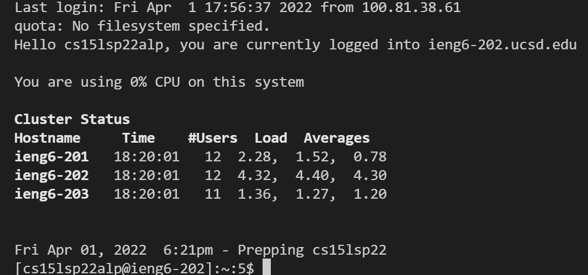
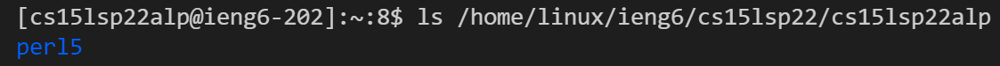
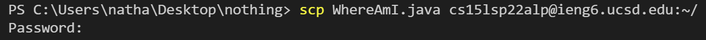
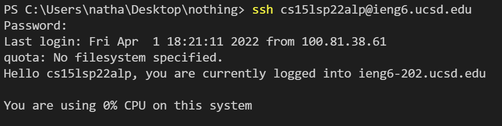
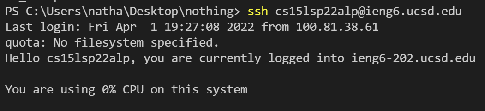

# Welcome New CS15L Student
## How to Connect Remotely!

First we must install [VSCode](https://code.visualstudio.com/download) (click the link to download)

Once set up VSCode should look like this 

After checking this we must install [OpenSSH](https://www.infragistics.com/products/indigo-design/help/images/vs-code-extension-drop-down.png) in order to remotely connect to servers with these accounts.

In order to see our CS15L specific account login we must go [here](https://sdacs.ucsd.edu/~icc/index.php) and lookup our three letter code used to login.

Now in VSCode we can open a new terminal. (Terminal, New Terminal)

First step is to type 
> $ ssh cs15lsp22zz@ieng6.ucsd.edu 

but replace zz with the 3 letter code found from earlier. 

Since this is the first time connecting you should see this message 

**The authenticity of host 'ieng6.ucsd.edu (128.54.70.227)' can't be established.**

**RSA key fingerprint is SHA256:ksruYwhnYH+sySHnHAtLUHngrPEyZTDl/1x99wUQcec.**

**Are you sure you want to continue connecting (yes/no/[fingerprint])?**

Say yes to this message.

Once entering your password your terminal should look like 

Now you are connected to the ieng6 server and you can now use terminal commands for the server itself.

Now you should try running some commands in this terminal.  Here are some examples

1. cd ~

2. cd

3. ls -lat

4. ls -a

5. ls <directory> where <directory> is /home/linux/ieng6/cs15lsp22/cs15lsp22abc, where the abc is your 3 letter code

6. cp /home/linux/ieng6/cs15lsp22/public/hello.txt ~/

7. cat /home/linux/ieng6/cs15lsp22/public/hello.txt

an example of using one of these commands will look like 

Now you will use **scp** in order to copy over some files between your client and the server.  First create a file called *WhereAmI.java* and put:

> class WhereAmI {
  public static void main(String[] args) {
    System.out.println(System.getProperty("os.name"));
    System.out.println(System.getProperty("user.name"));
    System.out.println(System.getProperty("user.home"));
    System.out.println(System.getProperty("user.dir"));
  }
}

When in your own client (if still on the server type **exit** to get back to your home directory on your client) and run *javac* and *java* for **WhereAmI.java** and notice the results.  Now run 
> scp WhereAmI.java cs15lsp22zz@ieng6.ucsd.edu:~/

this should look like 

and after typing in your password again this should put the **WhereAmI.java** file on the server.  Now connect to the server again and try running **ls** and now you should see the file on the server and should be able to use *javac* and *java* on the server.

So far it is clear to see that having to type in your password every time when logging into the server can take a long time.  It would be much easier to just bypass the password to work much more efficiently.  The solution here are **ssh** keys.  On your own client run the following commands:

> ssh-keygen

Generating public/private rsa key pair.

Enter file in which to save the key (/Users/<user-name>/.ssh/id_rsa): /Users/<user-name>/.ssh/id_rsa

Enter passphrase (empty for no passphrase): 

> Here it is very important to not put anything in the passphrase

Enter same passphrase again: 

Your identification has been saved in /Users/user-name/.ssh/id_rsa.

Your public key has been saved in /Users/user-name/.ssh/id_rsa.pub.

The key fingerprint is:
SHA256:jZaZH6fI8E2I1D35hnvGeBePQ4ELOf2Ge+G0XknoXp0 user-name@system.local

Now you need to copy the public key to **.ssh** directory of your user account on the server

Log onto the server and run the following commands:

>mkdir .ssh

>exit

>scp /Users/user-name/.ssh/id_rsa.pub cs15lsp22zz@ieng6.ucsd.edu:~/.ssh/authorized_keys

Now this should make it so you do not have to put in your password everytime for **ssh** and **scp** commands.  It should look like this:

Now we can run some commands on the server before loging in.  All you need to do is add the command after the **ssh** line in quotes and it will run on the server.

>ssh cs15lsp22zz@ieng6.ucsd.edu "ls" 

will run the "ls" command on the server while still on our own clients.  We can also add semicolons in order to run multiple commands

>cp WhereAmI.java OtherMain.java; javac OtherMain.java; java WhereAmI

Now working remotely will be much easier and more effecient.