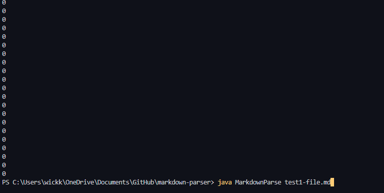
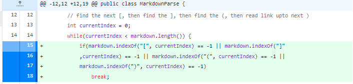
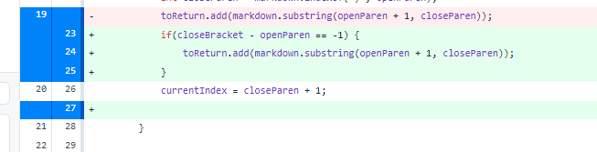
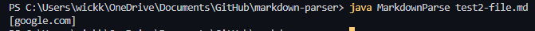
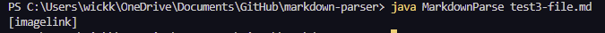
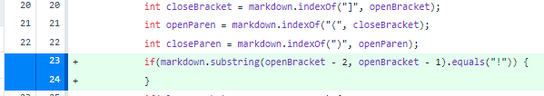

# Lab Report 2 Week 4
## 3 Bugs
The three bugs that I chose to fix are:
1. Not having all four componets of images ([, ], (, ))
2. Having a space between the closing bracket and the open parenthesis
3. Knowing when the link is a link and not an image.

---
The first bug comes from [this](test1-file.md) file.
When ran in the first iteration there is an infinite loop which I showed
by adding ``` System.out.println(currentIndex); ``` which shows its value is never updating
to break the loop.  
This error is fixed when adding and if statement first asking if all four of the 
conditions are there and if not then it breaks the loop.




---
The second bug that I fixed was from [this](test2-file.md) file.
It happens when there are spaces between the close bracket and open 
parenthesis which should not been seen as a link since that is not how
markdown reads links.  When ran before fixing the bug looked like it adds 
the links when it should not.  This is an easy fix 
by adding the two lines of code of 
Which checks if the bracket is next to the openParen which will determine if it is a real link or not.





---
The last bug I fixed was the code would also add an image link to the list when it should not treat it as the same.
It was caused from [this](test3-file.md) file.  The result from this bug looks like but this is 
an easy fix by adding code to check if before the first bracket if there is an "!" which would indicate that there is an image
There is some limitation to this since if the first line of the test file is a normal link then there will be an IndexOutOfBounds Error since ``` openBracket - 2 ``` will be a negative number.


