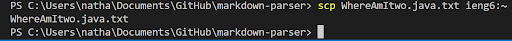
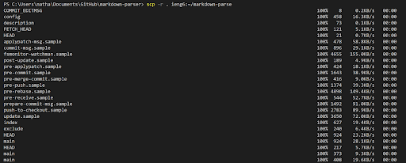
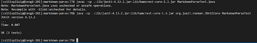
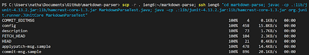
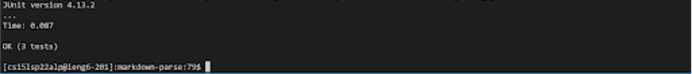

The first thing I did was create a file called
config and put the following code in.

``` 
Host ieng6
    HostName ieng6.ucsd.edu
    User cs15lsp22alp
```

Next I opened my power shell on my computer and on my 
home directory I did the following.




---
The first thing I did was create a key since this is on
my PC while the labs are done on my laptop.
Then I copied the key and pasted it into my Github 
New SSH key in settings.


Then I went back to VSCode and while in my labreport
respository and typed ``` git push origin main ```


This [results](https://github.com/NateWick4/cse15l-lab-reports/commit/b7dd2a1c8d8bff5069712c6989c5a8310450182d) with this commit.

---
First I copied my whole repository into the server as shown.



Then while in my ieng6 account I compiled and ran my JUnit tests.


Lastly I both ran and copied my markdown-parse in one line.
Due to the size of the terminal output I seperated the screenshots
into two parts.


