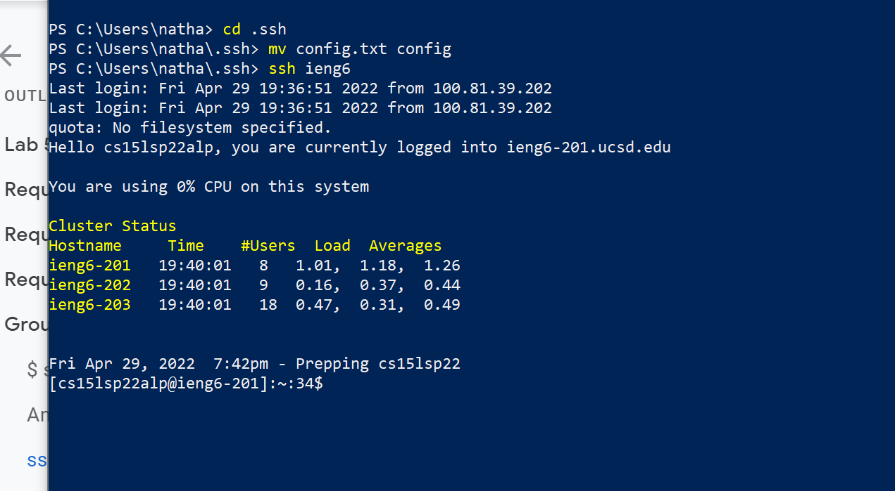
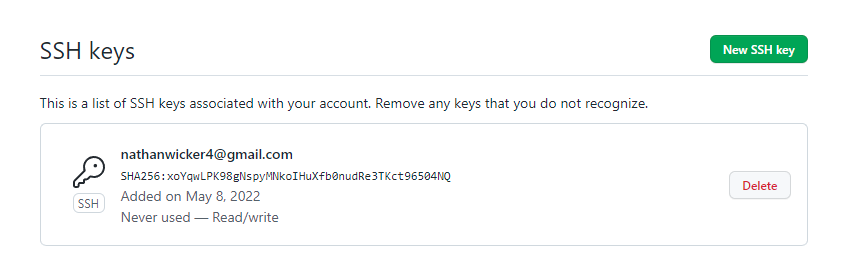
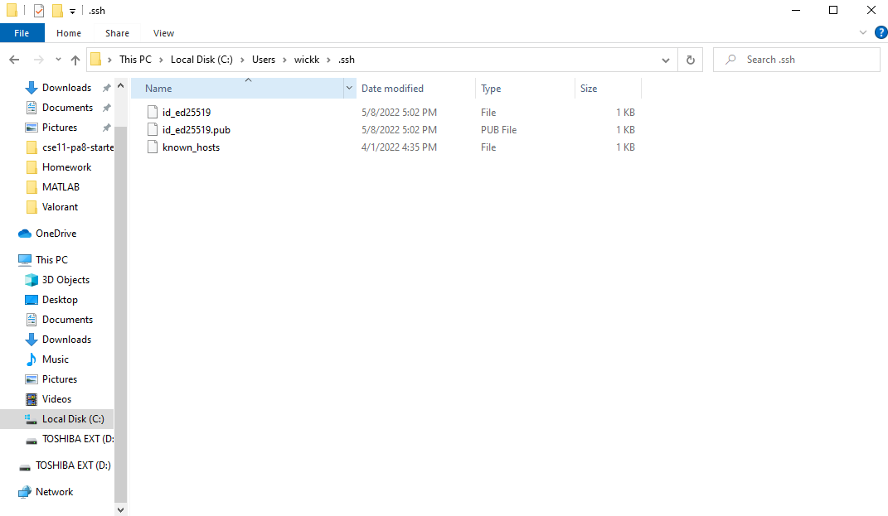
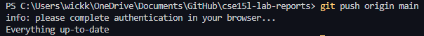

The first thing I did was create a file called
config and put the following code in.

``` 
Host ieng6
    HostName ieng6.ucsd.edu
    User cs15lsp22alp
```

Next I opened my power shell on my computer and on my 
home directory I did the following.



---



