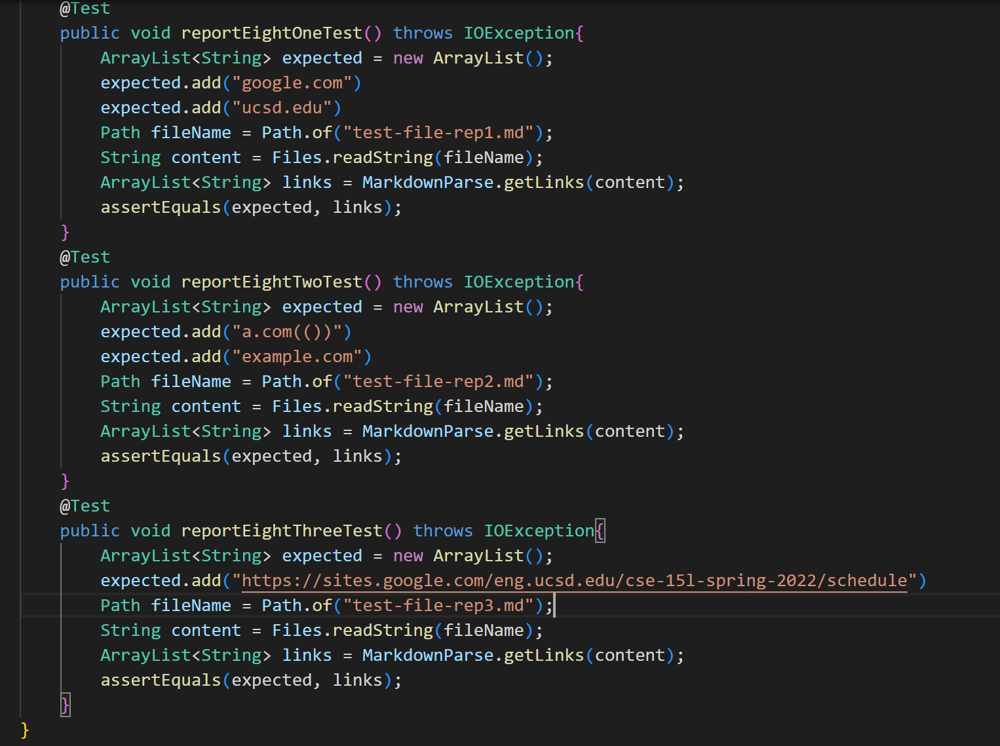
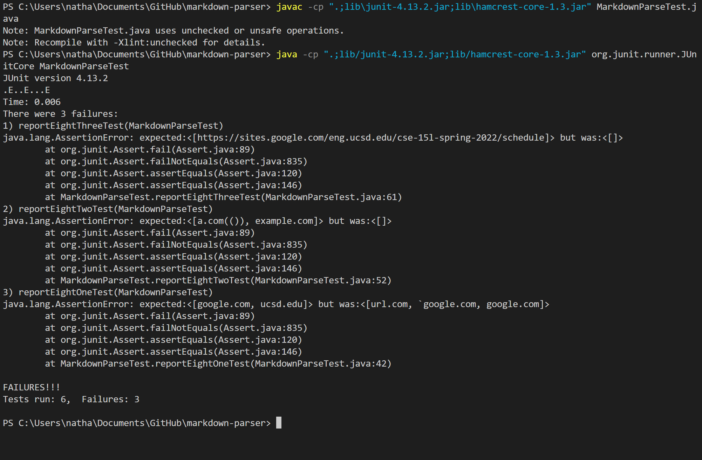
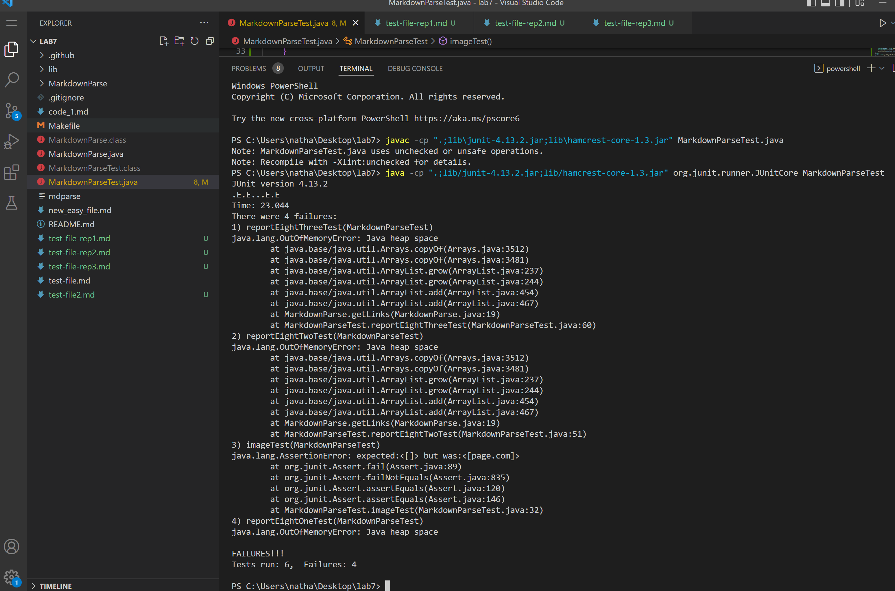

# Lab Report 4

## My markdown-parse

I started by added the test files for the 3 snippets into my markdown-parse.

Next I added the test case files which look like the following

Next I ran and compiled the JUnit test which resulted in the following

All 3 of the test cases failed.

## Test 1

For test 1 it seems that the code is getting confused what to do with the backticks.
In order to fix I would need to implement a statment that allows backticks anywhere besides before the link.  
It would then allow the md file reader to understand that the backticks do not change the link in anyway and it will then read the link like normal.

## Test 2 

For test 2 it seems that both the internal () as well as the internal [] messes with my implementation.  
In order to fix this I would need two new variables called parConstant and braConstant that would start at 1 and count the number of forward facing ( or [ and then we can not start counting what is a link or not when braConstant is 1 and keep putting stuff into the link until parConstant is back to 1.

## Test 3

This case is something that came up during on the labs.  
This is a case of not having one of the four  within the image.
The way my code is written once it finds that the first link does not have a closing ) it breaks the whole while loop which means it never reaches the other links.
The way to fix these issues is to change my code from break to make the currentIndex just update to the end of the previous end. 
This way the code can still continue with having an unfinished link at the start or the middle.

## Lab 7 markdown-parse

For the other imoplementation I created the same test files and copied the same JUnit tests and this is the output

All three tests failed for this implementation as well.