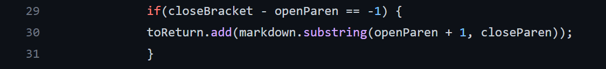
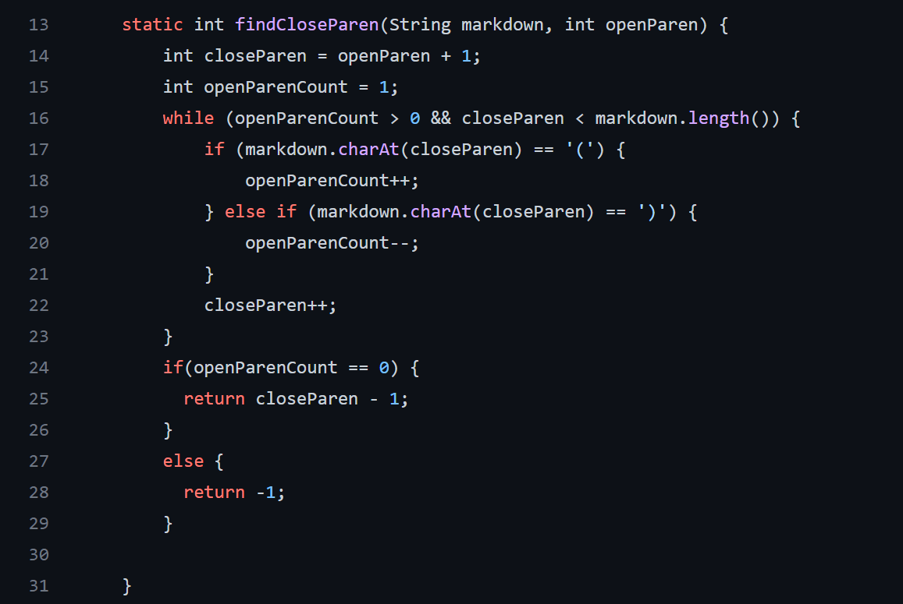

# Lab Report 5 Week 10

## Test Files

In order to find which test had different results I used vimdiff after running the bash for loop.

After I ran vimdiff it resulted in the following screenshot.

It is clear to see that test files 194, 201, and 342 seem to have different outputs so we will choose these files to look at.

## Links to test files

[194](https://github.com/nidhidhamnani/markdown-parser/blob/main/test-files/194.md)

[201](https://github.com/nidhidhamnani/markdown-parser/blob/main/test-files/201.md)

[342](https://github.com/nidhidhamnani/markdown-parser/blob/main/test-files/342.md)

## Problems With Each Test

### 194

According to commonmark the correct output should be [url] so my implementation is not correct and the other implementation is correct.

For my bug it appears that the bug is I check to see if the openParen is next to the closed bracket which seems to not always be the case.  

To fix this I would have to check if there is more than 1 space between the closed bracket and openParen I should then check if there are charaters between and not spaces.

### 201

According to commonmark the correct output should be [] which would mean that my output is correct and the other implementation would be incorrect.

For their bug it seems that they do not check if there are spaces inbetween the closed bracket and the openParen.

To fix this they would need to check if there is more space between these two then to check if that space contains a space.

### 342

According to commonmakr the correct output should be [] which would mean that my implementation is correct while theirs is not.

For their bug it seems that their code is reading ` as part of the link and not making what is inbetween the backtics as connecting the words together.

In order to fix this buf there would need to check if there is a backtic in the link part to then know that it is not a link and to not added it.  

This condition would be added here in their code

